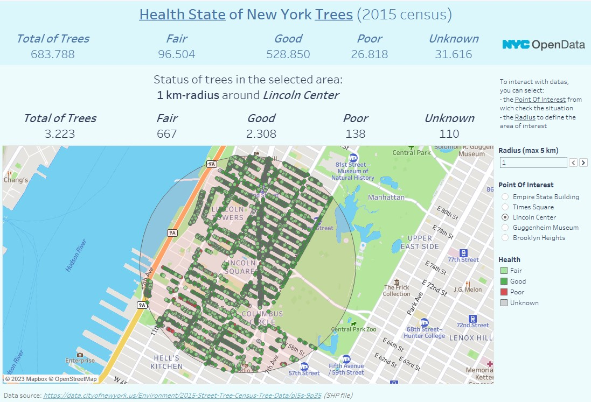
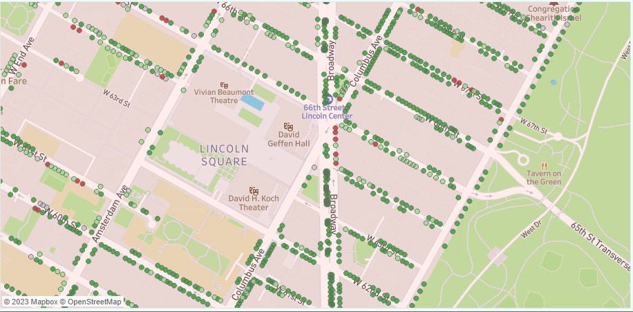
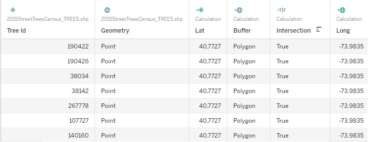

# Tableau_2022.4_intersects_function

This is a short project for the sole purpose of demonstrating how to use the new geospatial **intersects** feature in Tableau 2022.4.  
The Interactive Visualization Dashboard can be displayed at the link [Health State of New York Trees](https://public.tableau.com/app/profile/barbara.callegari/viz/HealthStateofNewYorkTrees/Dashboard1) on my Tableau profile.

## Scope of the project
1. **Demonstrating how to use** the new geospatial **INTERSECTS** feature in Tableau 2022.4
2. Create an **interactive Tableau Dashboard** with the option to select dynamically:
    * The **Point of Interest**, which will become the center of the area to be analysed
    * The **Radius** by which to expand the selection area
3. The analysis purpose was to verify the **health state of the trees in the selected area**.
  
This is the **Dashboard**:

This is a **zoom** of the health state of tree in the selected zone:

## Project details

The map has two layers:
* Geometry, with the representation of all censed trees.
* Buffer, with the area to focus on. The buffer area is a circle, its center is defined by the Point of Interest parameter, its radius is defined by the Radius (km) parameter

The **INTERSECTS** function **returns a boolean and in this project is used as a filter** to select only the trees present within the Buffer area.

This is the code for the **Intersection** calculated field and for all other calculated fields on which depends:

<dl>
    <dt><strong>Intersection</strong></dt>
    <dd><code>INTERSECTS([Buffer],[Geometry])</code>
    <dt><strong>Buffer</strong></dt>
        <dd><code>BUFFER(MAKEPOINT([Lat],[Long]),[Radius (km)],'km')</code></dd>
    <dt><strong>Lat</strong></dt>
       <dd><code>FLOAT(SPLIT([Point_Of_Interest],',',1))</code></dd>
    <dt><strong>Long</strong></dt>
        <dd><code>FLOAT(SPLIT([Point_Of_Interest],',',2))</code></dd>
</dl>

* The **Geometry** field is native from the data source and its datatype is Point (a spatial object defined by latitude and longitude).
* The **Buffer** field is a calculated field (as shown above) and its datatype is Polygon (a spatial circular shape defined by a Point at the center, and a radius as distance from the center).
  
  

  
  
The other calculated fields present in the Tableau notebook are the typical Level Of Details to calculate the statistical data considering both the trees within the selected area and those present in the entire dataset.

### Data Source
The **2015 Street Tree Census - Tree Data** for this project can be found on [NYC OpenData](https://data.cityofnewyork.us/Environment/2015-Street-Tree-Census-Tree-Data/pi5s-9p35).  
More specifically, the data source for this Tableau workbook is the geospatial shapefile [2015StreetTreesCensus_TREES.shp](https://github.com/babiotg/Tableau_2022.4_intersect_function/tree/main/data) which is located inside the *data* folder of this repository.

### Author 
[Barbara Callegari](https://numberslab.net)  
To learn more about the author visit my [LinkedIn Profile](https://www.linkedin.com/in/barbaracallegari)

### Licence
**If you find this code useful, please give me a skill endorsement in Tableau and Data Analysis on LinkedIn**.   
Visit me at https://www.linkedin.com/in/barbaracallegari